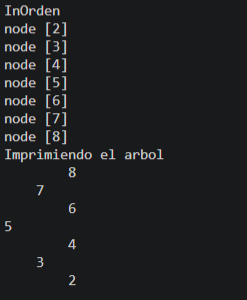
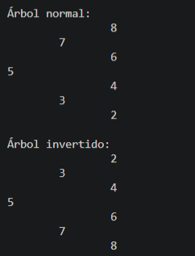
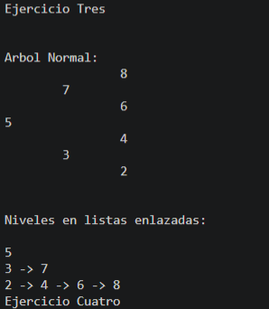
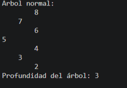
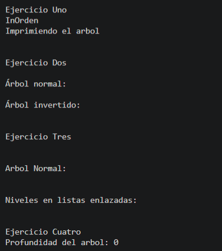
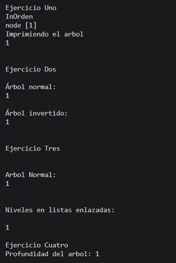
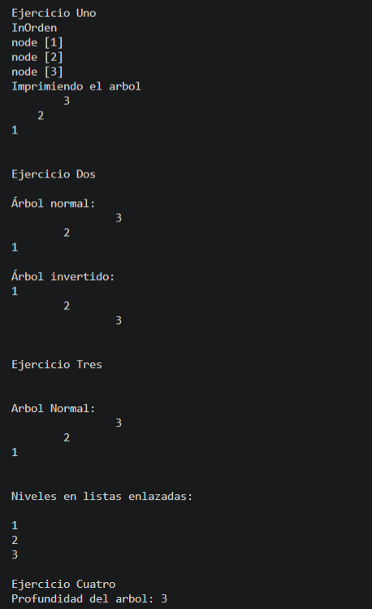
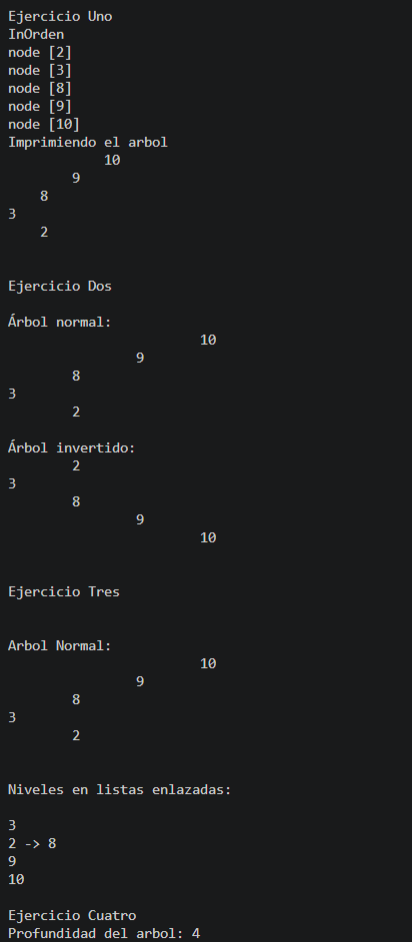

# Ejercicios con Estructuras no Lineales
## Estudiante: Angelo ALtamirano
## Fecha: 24/06/2026

## Descripción:

Para esta practica aplicamos arboles binarios en cada ejercicio realizado, desarrollamos insercion de nodos, inversion de ramas, recorrido por niveles y calculamos la profundidad de cada arbol.
Mediante el desarrollo de la practica utilizamos estructuras genéricas, nodos enlazados y recorridos recursivos y támbien realizamos distintos casos de prueba para verificar el funcionamiento de cada código, incluyendo árboles vacíos, árboles de un solo nodo, árboles con varios niveles y árboles con nodos a la izquierda.

## Ejercicio 1:
## Insert en BST

```java
public void insert(int [ ] numeros){
        //crear arbol de enteros
        BinaryTree<Integer> tree = new BinaryTree<>();
        
        //insertar cada numero
        for (int numero : numeros) {
            tree.add(numero);
        }
        //imprimir el arbol en orden
        System.out.println("InOrden");
        tree.inOrden();
        printTree(tree.getRoot());


    }
    public void printTree(node<Integer> root){
    System.out.println("Imprimiendo el arbol");
    printTreeRecursivo(root, 0);
    }
    private void printTreeRecursivo(node<Integer> node, int level) {
        if (node == null) {
            return;
        }
        printTreeRecursivo(node.getRight(), level + 1);
        for(int i = 0; i < level; i++) {
            System.out.print("    ");
        }
        System.out.println(node.getValue());
        printTreeRecursivo(node.getLeft(), level + 1);
    }
```
Esta clase construye un árbol binario a partir de una lista de números recibida como parámetro, insertando cada valor de forma secuencial.Para visualizar la estructura, se utiliza un método recursivo que recorre el árbol en orden inverso (Derecha -> Raíz -> Izquierda) e imprime los nodos de forma horizontal. El método calcula automáticamente la profundidad de cada nodo y añade una tabulación proporcional a su nivel, permitiendo apreciar la jerarquía visual del árbol de un solo vistazo. Este mismo sistema de impresión se reutiliza en el resto de los ejercicios del proyecto.

## Salida



## Ejercicio 2:
## Invertir árbol binario

```java
private void printTree(node<Integer> actual, int nivel) {
        if (actual == null) {
            return;
        }
        printTree(actual.getRight(), nivel + 1);
        for (int i = 0; i < nivel; i++) {
            System.out.print("\t");
        }
        System.out.println(actual.getValue());
        printTree(actual.getLeft(), nivel + 1);
    }
    private void invertirRamas(node<Integer> actual) {
        if (actual == null) {
            return;
        }
        node<Integer> aux = actual.getLeft();
        actual.setLeft(actual.getRight());
        actual.setRight(aux);
        invertirRamas(actual.getLeft());
        invertirRamas(actual.getRight());
    }   
```
Su funcion es invertir por completo las ramas de un árbol binario. El proceso comienza recibiendo la raíz del árbol como parámetro para imprimir su estructura original en pantalla.

Luego, se llamamos al método recursivo que recorre cada nodo y realiza un intercambio y almacena temporalmente el hijo izquierdo, asigna el hijo derecho en su lugar y, finalmente, coloca el nodo guardado en la posición derecha. Este procedimiento se replica de forma descendente en todo el árbol hasta que su estructura queda totalmente simétrica a la original, concluyendo con la impresión del árbol invertido.

## Salida



## Ejercicio 3:
## Listar Niveles

```java
public List<List<node>> listLevels(node root){
        List<List<node>> levels = new ArrayList<>();
        llenarNiveles(root, 0, levels);
        return levels;
    }

    private void llenarNiveles(node root, int level, List<List<node>> levels) {
        if (root == null) {
            return;
        }
        if (levels.size() == level) {
            levels.add(new ArrayList<>());
        }
        levels.get(level).add(root);
        llenarNiveles(root.getLeft(), level + 1, levels);
        llenarNiveles(root.getRight(), level + 1, levels);

    }
    public void printLevels(node root){
        System.out.println();
        System.out.println("Ejercicio Tres");
        System.out.println();

        System.out.println();
        System.out.println("Arbol Normal:");
        printTree(root, 0);
        System.out.println();

        System.out.println();
        System.out.println("Niveles en listas enlazadas:");
        System.out.println();

        List<List<node>> niveles = listLevels(root);

        for (List<node> nivel : niveles) {
            for (int i = 0; i < nivel.size(); i++) {
                System.out.print(nivel.get(i).getValue());
                if (i < nivel.size() - 1) {
                    System.out.print(" -> ");
                }
            }
            System.out.println();
        }
    }
    private void printTree(node<Integer> actual, int nivel) {
        if (actual == null) {
            return;
        }
        printTree(actual.getRight(), nivel + 1);
        for (int i = 0; i < nivel; i++) {
            System.out.print("\t");
        }
        System.out.println(actual.getValue());
        printTree(actual.getLeft(), nivel + 1);
    }
```
Esta clase sirve para agrupar los nodos del árbol según el nivel en el que se encuentran y guardarlos en una lista. El proceso comienza recibiendo la raíz y creando una lista principal para almacenar los resultados; luego, se utiliza un método que recorre el árbol nodo por nodo llevando la cuenta del nivel actual. Si se llega a un nivel por primera vez, se crea una lista nueva para este, y después se agrega el nodo actual en la lista que le corresponde. Finalmente, el proceso se repite automáticamente con el hijo izquierdo y el hijo derecho, sumando uno al nivel cada vez que se avanza hacia abajo.

## Salida



## Ejercico 4:
## Profundidad máxima
```java
public int maxDepth(node root){
        
        return maxDepthRecursivo(root);
        
        
    }
    private int maxDepthRecursivo(node root){
        if(root == null){
            return 0;
        }
        int leftDepth = maxDepthRecursivo(root.getLeft());
        int rightDepth = maxDepthRecursivo(root.getRight());
        return Math.max(leftDepth, rightDepth) +1;

    }
    public void arbolNormal(node root){

        System.out.println("Arbol normal:");
        printTreeRecursivo(root, 0);
```
Esta clase sirve para calcular la altura o profundidad máxima de un árbol binario. El proceso comienza recibiendo la raíz del árbol y llamando a un método que revisa los nodos uno por uno; si el nodo actual está vacío, regresa cero porque significa que ya no hay más niveles. Después, el método calcula por separado la profundidad del lado izquierdo y del lado derecho para comparar cuál de los dos lados es el más alto. Finalmente, se elige el lado con mayor número de niveles, se le suma uno para contar el nodo en el que estamos parados, y se regresa ese resultado como la profundidad total del árbol.

## Salida



## Ejercicios de prueba:

Se realizo pruebas con diferentes casos para asegurar el correcto funcionamiento de los algoritmos.

## Arbol vacio



## Arbol con un solo Nodo:



## Arbol solo hacia la derecha:



## Arbol con varios Niveles:



